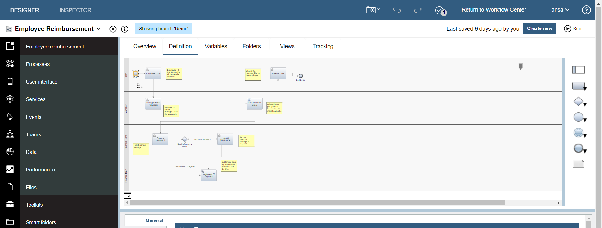

# aryan993-Employee-Reimbursement-IBM-Cloud
This project is a practice project done for understanding the concept and working of the IBM service where I made a BPD in order to create a web app to get the details and file of the bills that are needed to be submitted by the employee for the reimbursement.

