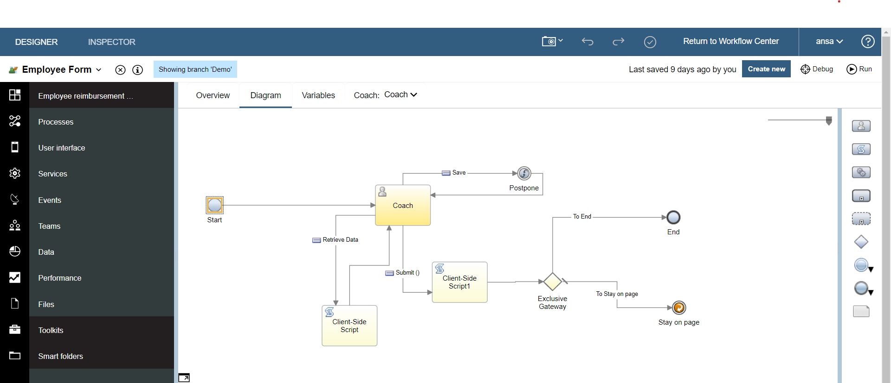
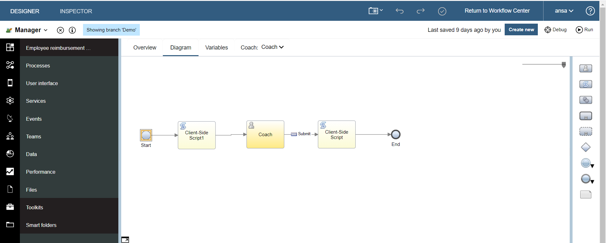
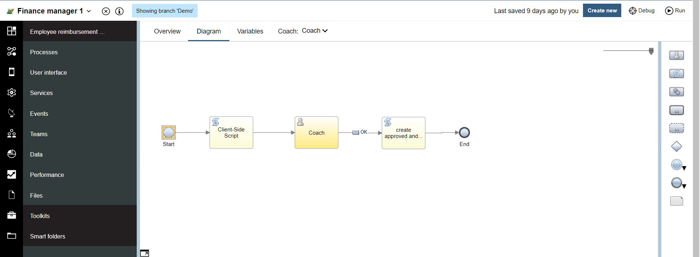
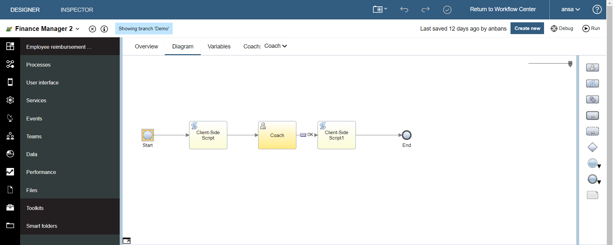
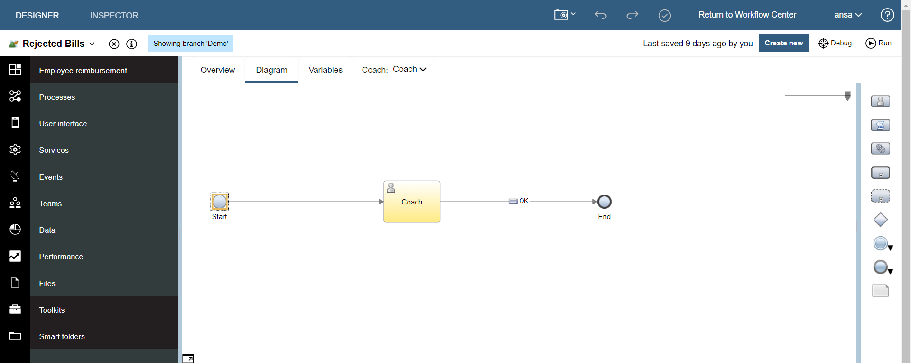

# aryan993-Employee-Reimbursement-IBM-Cloud
NOTE: 	/*This is just a learning project created to understand the IBM and does not associate with any corporation project or contain 
	any kind of employee or corporate data*/
This project is a practice project done for understanding the concept and working of the IBM service where I made a BPD in order to create a web app to get the details and file of the bills that are needed to be submitted by the employee for the reimbursement.

In order to run the web app you need to import the file and mail me request for the read permision.

In case if you need to see the working of the app you can just go to process app in the IBM service and search in public for Employee 
Reimbursement ( basically by the name of the file) ther you will be able to run the code.
